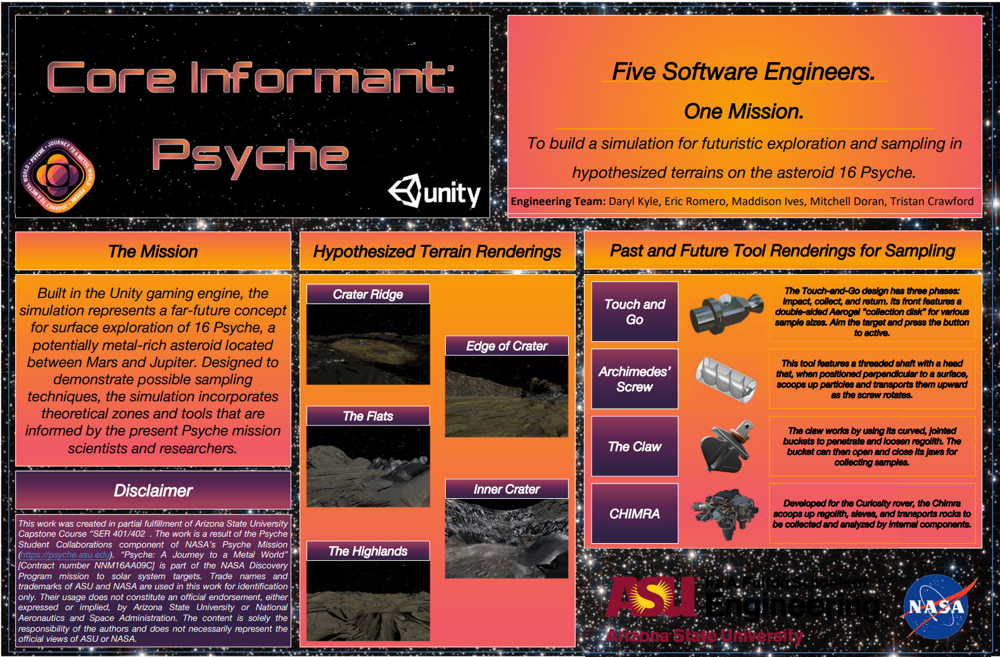
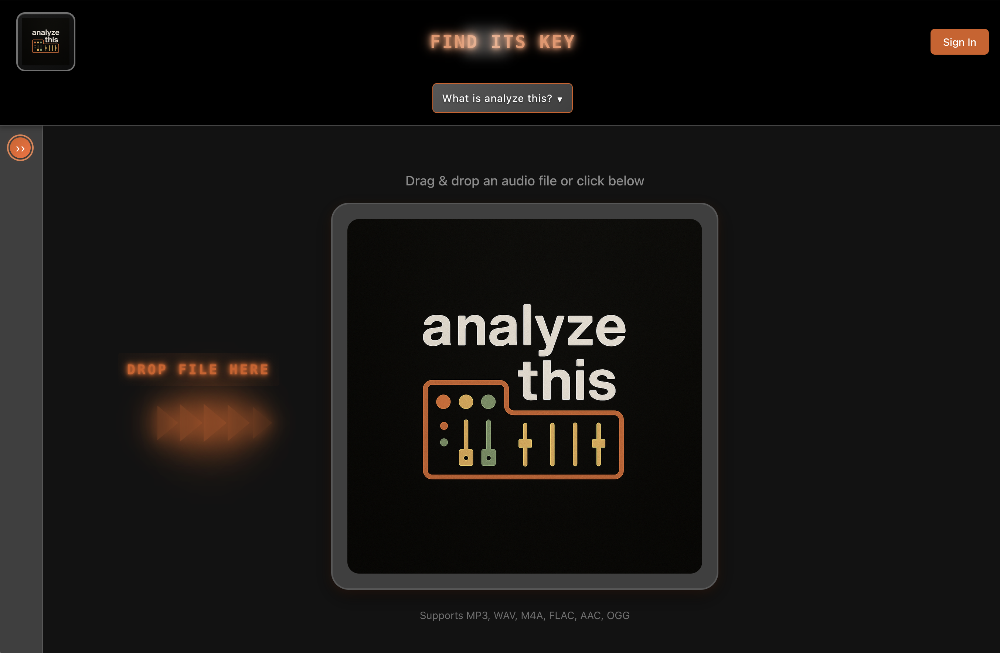

<h1 align="center">
  <a href="https://mitchelld.net" target="_blank" style="text-decoration: none; color: inherit;">
    🔗 Mitchell D. | Software x Audio Engineer 🧑🏻‍💻🎧 
  </a>
</h1>

<h1 align="center">Welcome❗️ 欢迎❗️ Добро пожаловать❗️ स्वागत है❗️ Bienvenidos❗️</h1>

👁️ a visual snapshot of some of my projects 👁️

---

  
  
  <!--    -->
  
  

---

<!--
**mdoran3/mdoran3** is a ✨ _special_ ✨ repository because its `README.md` (this file) appears on your GitHub profile.

Here are some ideas to get you started:

- 🔭 I’m currently working on ...
- 🌱 I’m currently learning ...
- 👯 I’m looking to collaborate on ...
- 🤔 I’m looking for help with ...
- 💬 Ask me about ...
- 📫 How to reach me: ...
- 😄 Pronouns: ...
- ⚡ Fun fact: ...
-->
